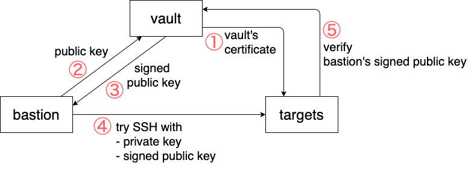
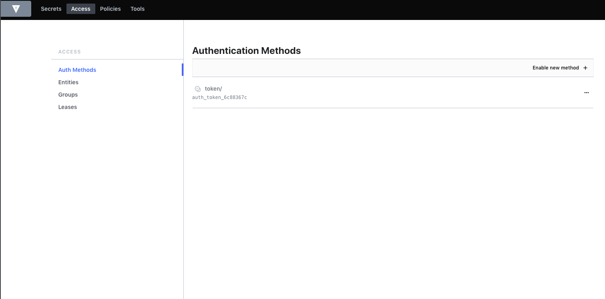
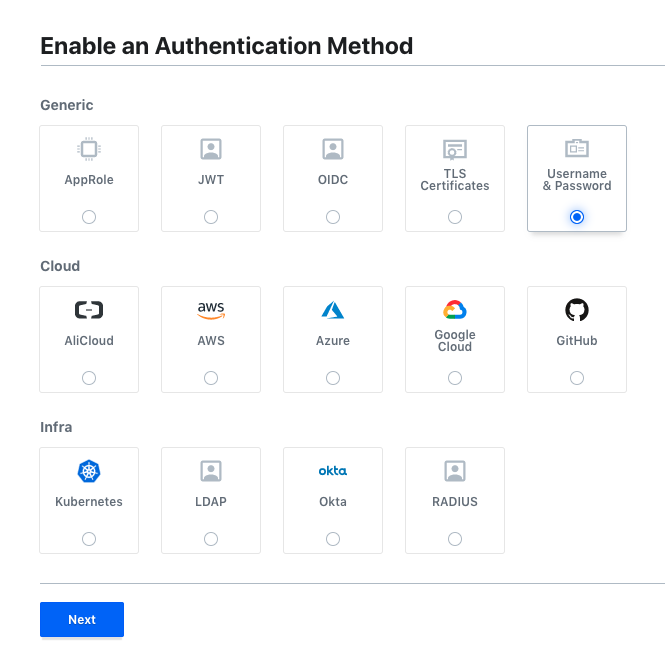
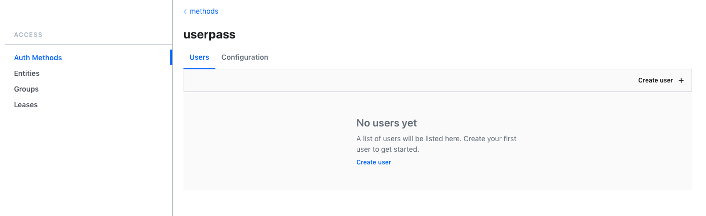
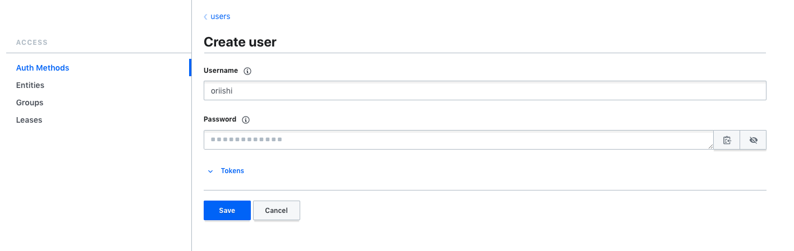
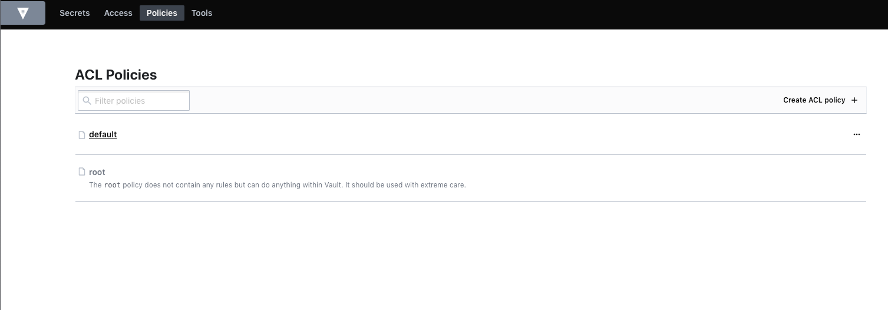
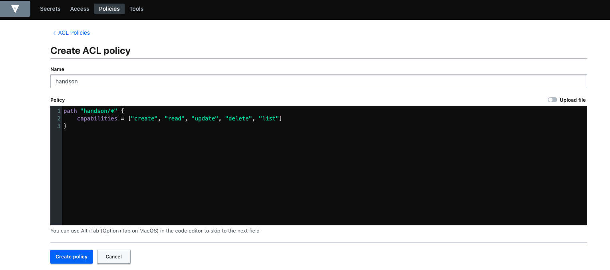
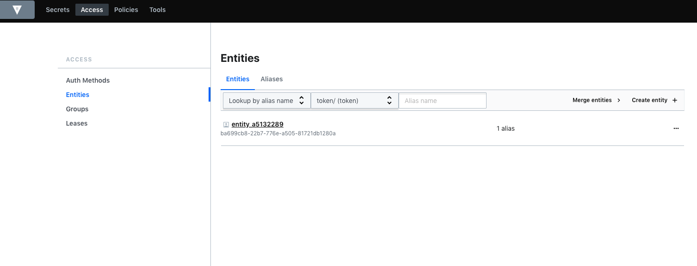
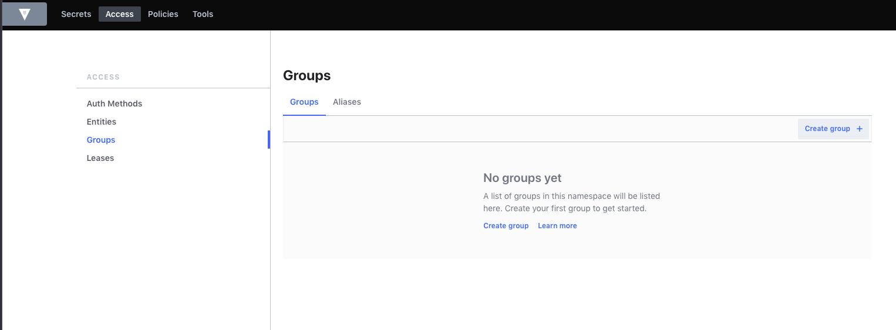

# Signed SSH Certificates (Hands on)

[Signed SSH Certificates](https://www.vaultproject.io/docs/secrets/ssh/signed-ssh-certificates)のハンズオンリポジトリです。

ここでは[Hashicorp Vault](https://www.vaultproject.io/)をCA局とし、クライアントが同一の鍵を用いて複数のサーバへログインできる仕組みを用意します。



## ハンズオン

まずdocker-composeで一通りのシステムを動作させます。

```sh
$ docker-compose up -d
```

ここで <http://localhost:8081> へアクセスして "Wecome to nginx!" が表示されることを確認しましょう。

### Vaultの起動

次にVaultを使用するためのアカウント作成を行います。

<http://localhost:8200/ui> にアクセスしてください。

最初にunseal用の鍵を生成します。

- Key shares: 生成する鍵の個数
- Key threshold: 鍵がいくつ集まればunsealできるか

(ここではそれぞれ1, 1で大丈夫です)

パラメタを指定して "Initialize" すると、以下のシークレット情報が吐き出されます。

きちんと控えておきましょう。

- Initial root token: rootユーザのログイン用トークン
- Key1: vaultのロック(sealed)状態を解除するための鍵

> 大事な情報なので絶対に忘れないでください!!

> ここでトークンを控え忘れた場合は、docker-composeを落とした後に `vault/file` 以下を全て削除してから起動し直してください。
> 1. `docker-compose down`
> 1. `rm -rf vault/file/*`
> 1. `docker-compose up -d`

# アカウント作成

次に先ほど作成したroot tokenを使ってログインしましょう。

"Access" -> "Auth Methods" -> "Enable new method" で新しいログイン方式を作成します。



次に追加するログイン方法を選びます。


"Username & Password" を選択してください。



オプションなどは特に指定しなくても大丈夫です。

完了後 "Access" -> "Auth Methods" -> "userpass" が追加されます。

ここで "Create user" へ進みましょう。

> ここで作るユーザはユーザ名 "oriishi" として進めていきます。
> コマンドなどは適宜読み替えてください。




自分の使用したいアカウント情報を入力してアカウント作成完了です。



一度rootアカウントからログアウトして作ったアカウントにログインしましょう。

> ここで一度ログインしておかないと、Entityが作成されず後述のグループへの追加が行えません。

### ポリシの作成

再びrootアカウントでログインし直しておください。

"Policies" -> "Create ACL policy" へ進みます。



以下のルールでhandsonポリシを作成します。

```hcl
path "handson/*" {
    capabilities = ["create", "read", "update", "delete", "list"]
}
```



### アカウントグループの作成と設定

"Access" -> "Entities" を確認してEntityが作成されているか確認してください。

> なければ先ほど作ったユーザで一度ログインした後にrootでログインし直してください。



"Access" -> "Groups" -> "Create group" でグループを作って行きます。



handsonグループを作成していきます、パラメタは以下を指定しましょう。

- Policies: handson, default
- Member Entity IDs: 先ほど確認したユーザのEntity

EntityやGroupの詳細は[Group-Entity-Aliasの関係](https://learn.hashicorp.com/tutorials/vault/identity)を確認してください。

### VaultのCAセットアップ

"Secrets" -> "Enable new engine" で新しいシークレットエンジンを作ります。

- 種類: SSH
- 名前: handson

で作りましょう。

```sh
# vaultコンテナでシェルを実行して操作
$ docker-compose exec vault sh
# rootトークンでログイン
$ vault login
> Token (will be hidden):
$ vault write handson/config/ca generate_signing_key=true
$ exit
```

### ターゲットのセットアップ

```sh
$ docker-compose exec target1 sh
$ vault login -method=userpass username=oriishi
# vaultのCA局の公開鍵を取得
$ vault read -field=public_key handson/config/ca > /etc/ssh/trusted-user-ca-keys.pem
# sshdがvaultのCA局を信用するように指定
$ echo "TrustedUserCAKeys /etc/ssh/trusted-user-ca-keys.pem" >> /etc/ssh/sshd_config
# sshdの起動
$/etc/init.d/ssh restart
$ exit
```

### クライアントのセットアップ

```sh
$ docker-compose exec bastion1 sh
$ vault login -method=userpass username=oriishi
# SSH用のvaultロールを作成
$ vault write handson/roles/oriishi -<<"EOH"
{
  "allow_user_certificates": true,
  "allowed_users": "*",
  "allowed_extensions": "permit-pty,permit-port-forwarding",
  "default_extensions": [
    {
      "permit-pty": ""
    }
  ],
  "key_type": "ca",
  "default_user": "root",
  "ttl": "87600h"
}
EOH
# 設定を確認
$ vault read handson/roles/oriishi
# ssh鍵の生成
$ ssh-keygen -t rsa -C "oriishi@example.com"
# 鍵を登録
$ vault write handson/sign/oriishi public_key=@$HOME/.ssh/id_rsa.pub -<<"EOH"
{
  "valid_principals": "root",
  "extensions": {
    "permit-pty": "",
    "permit-port-forwarding": ""
  }
}
EOH
# 署名付き鍵を取得 (秘密鍵-cert.pubの名前にしないと、sshコマンドで -i で秘密鍵と署名付き公開鍵両方を指定しないといけない)
$ vault write -field=signed_key handson/sign/oriishi public_key=@$HOME/.ssh/id_rsa.pub > $HOME/.ssh/id_rsa-cert.pub
# 署名付き公開鍵の詳細を確認
$ ssh-keygen -Lf ~/.ssh/id_rsa-cert.pub
```

### SSH実行

```sh
# 
$ ssh -i ~/.ssh/id_rsa root@target1
```
> 本当は `ssh -i ~/.ssh/id_rsa-cert.pub -i ~/.ssh/id_rsa root@target1` のように証明書と秘密鍵を両方指定しないといけないのですが、OpenSSHの仕様として`<秘密鍵>-cert.pub`の名称の証明書があれば、自動で使ってくれるので便利です。

Tips
> 

### ターゲットの表示変更

```sh
# 自分の好きなように表示を変えてみよう！
$ vim /usr/share/nginx/html/index.html
```

<http://localhost:8081> へアクセスして確認

### 複数台のサーバへログイン

ターゲットのセットアップで実施したステップをtarget2コンテナでも実施して、同様にログインして作業できるか試してみましょう！

target2のNginxは<http://localhost:8082>からアクセスできます。
